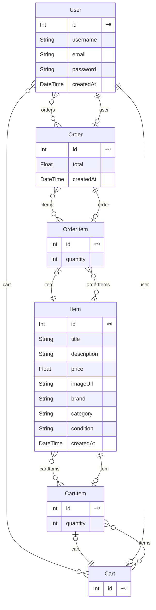

# 01 — Schéma de la base de données

> Source : `my-app/prisma/schema.prisma`. SQL généré hors ligne avec
> `npx prisma migrate diff --from-empty --to-schema-datamodel prisma/schema.prisma --script`
> (aucune connexion à une base n'est établie par cette commande).

## 1. Modèle physique de données (récapitulatif)

SGBD : **PostgreSQL** (hébergé sur Neon, région eu-west-2). ORM : **Prisma 5.20**.
Toutes les clés primaires sont des entiers auto-incrémentés (`@id @default(autoincrement())`),
sauf les tables d'association qui utilisent une clé composite.

### Tables métier

| Table | Colonnes principales | Clés & contraintes | onDelete |
|---|---|---|---|
| **User** | id, firstName, lastName, email, password?, emailVerified?, image?, bio?, authProviderId?, stripeAccountId?, stripeOnboarded, suspended, suspendedReason?, createdAt, updatedAt | PK id · UNIQUE email | — |
| **Product** | id, userId, title, description?, price Decimal(10,2), condition, category?, brand?, size?, status, suspended, createdAt, updatedAt | PK id · FK userId → User | Cascade |
| **ProductImage** | id, productId, url, altText? | PK id · FK productId → Product | Cascade |
| **Offer** | id, productId, buyerId, offerPrice Decimal(10,2), status, expiresAt?, createdAt, updatedAt | PK id · FK productId → Product · FK buyerId → User | Cascade |
| **Like** | userId, productId, createdAt | **PK composite (userId, productId)** · FK ×2 | Cascade |
| **Order** | id, productId, sellerId, buyerId, offerId?, finalPrice Decimal(10,2), paymentIntentId, transferGroup, status, shippedAt?, confirmDeadline?, trackingNumber?, disputeReason?, disputeDetails?, createdAt, updatedAt | PK id · **UNIQUE paymentIntentId** · FK productId/sellerId/buyerId | Cascade |
| **OrderDisputeImage** | id, orderId, url | PK id · FK orderId → Order | Cascade |
| **Transaction** | id, productId, sellerId, buyerId, finalPrice Decimal(10,2), createdAt | PK id · FK ×3 | Cascade |
| **Chargeback** | id, stripeId, orderId?, amount Decimal(10,2), reason?, status, createdAt, updatedAt | PK id · **UNIQUE stripeId** · FK orderId → Order | — (nullable) |
| **Report** | id, reporterId, reason, details?, status, productId?, reportedUserId?, createdAt, updatedAt | PK id · FK reporterId → User (Cascade) · FK productId, reportedUserId | **SetNull** |

### Tables de messagerie

| Table | Colonnes principales | Clés & contraintes | onDelete |
|---|---|---|---|
| **Conversation** | id, productId?, createdAt, updatedAt | PK id · N-N implicite avec User (`UserConversations`) | — |
| **Message** | id, content, productId, userId, conversationId, createdAt | PK id · FK ×3 | Cascade |
| **ConversationRead** | userId, conversationId, lastReadAt | **PK composite (userId, conversationId)** · FK ×2 | Cascade |

### Tables d'administration

| Table | Colonnes principales | Clés & contraintes |
|---|---|---|
| **AdminLog** | id, action, target?, details?, createdAt | PK id — table de journalisation, sans FK |
| **AdminMessage** | id, userId, subject, body, read, createdAt | PK id · FK userId → User (Cascade) |

### Tables NextAuth (présentes au schéma, non exploitées : stratégie JWT)

| Table | Clés |
|---|---|
| **Account** | PK composite (provider, providerAccountId) · FK userId → User (Cascade) |
| **Session** | PK id · UNIQUE sessionToken · FK userId (Cascade) |
| **VerificationToken** | PK composite (identifier, token) |
| **Authenticator** | PK composite (userId, credentialID) · UNIQUE credentialID |

### Énumérations

| Enum | Valeurs |
|---|---|
| `Condition` | Neuf · Comme_neuf · Bon_etat · Moyen_etat · Mauvais_etat |
| `Category` | Deck · Truck · Roue · Chaussure · Vetement · Accessoire |
| `ProductStatus` | available · reserved · sold |
| `OfferStatus` | pending · accepted · rejected |
| `OrderStatus` | paid · shipped · confirmed · disputed · refunded |
| `ReportStatus` | pending · reviewed · dismissed |

### Remarques de conception

- **Aucun index explicite** (`@@index`) n'est déclaré en dehors des PK et UNIQUE.
  Les recherches fréquentes (`Product.status`, `Product.category`, `Order.status`)
  s'appuient donc sur des parcours séquentiels.
- `Product.category` est **optionnelle** au schéma alors que le formulaire de création
  la rend obligatoire côté client.
- Les images sont stockées **en base** sous forme de data-URI base64
  dans `ProductImage.url` (colonne `String`), sans stockage objet externe.
- `Report` utilise `onDelete: SetNull` sur ses cibles afin de conserver
  l'historique de modération même après suppression du contenu signalé.

## 2. Schéma Prisma intégral

**Chemin :** `my-app/prisma/schema.prisma` — 336 lignes

```prisma
datasource db {
  provider = "postgresql"
  url      = env("DATABASE_URL")
}

generator client {
  provider      = "prisma-client-js"
  binaryTargets = ["native", "rhel-openssl-1.0.x", "rhel-openssl-3.0.x"]
}

// Table User
model User {
  id             Int             @id @default(autoincrement())
  firstName      String
  lastName       String
  email          String          @unique
  password       String?
  emailVerified  DateTime?
  image          String?
  bio            String?
  authProviderId String?

  stripeAccountId  String?
  stripeOnboarded  Boolean @default(false)

  // Relations
  accounts            Account[]
  sessions            Session[]
  Authenticator       Authenticator[]

  products            Product[]
  offers              Offer[]
  likes               Like[]

  conversations       Conversation[]   @relation("UserConversations")
  conversationReads   ConversationRead[]
  sentMessages        Message[]        @relation("SentMessages")

  transactionsBuyer   Transaction[]    @relation("BuyerTransactions")
  transactionsSeller  Transaction[]    @relation("SellerTransactions")

  ordersBuyer         Order[]          @relation("OrderBuyer")
  ordersSeller        Order[]          @relation("OrderSeller")

  suspended           Boolean          @default(false)
  suspendedReason     String?

  reportsMade         Report[]         @relation("ReportsMade")
  reportsReceived     Report[]         @relation("ReportsReceived")
  adminMessages       AdminMessage[]

  createdAt           DateTime        @default(now())
  updatedAt           DateTime        @updatedAt
}

model Conversation {
  id           Int        @id @default(autoincrement())
  productId    Int?

  participants User[]              @relation("UserConversations")
  messages     Message[]           @relation("ConversationMessages")
  reads        ConversationRead[]

  createdAt    DateTime   @default(now())
  updatedAt    DateTime   @updatedAt
}

model ConversationRead {
  userId         Int
  conversationId Int
  lastReadAt     DateTime @default(now())

  user           User         @relation(fields: [userId], references: [id], onDelete: Cascade)
  conversation   Conversation @relation(fields: [conversationId], references: [id], onDelete: Cascade)

  @@id([userId, conversationId])
}

model Message {
  id             Int        @id @default(autoincrement())
  content        String
  productId      Int        // ID du produit auquel ce message est lié
  userId         Int        // ID de l'utilisateur qui envoie le message
  conversationId Int        // ID de la conversation à laquelle ce message est lié
  createdAt      DateTime   @default(now())

  // Relations
  product        Product     @relation(fields: [productId], references: [id], onDelete: Cascade)
  user           User        @relation("SentMessages", fields: [userId], references: [id], onDelete: Cascade)
  conversation   Conversation @relation("ConversationMessages", fields: [conversationId], references: [id], onDelete: Cascade)
}


model Product {
  id          Int             @id @default(autoincrement())
  userId      Int
  title       String
  description String?
  price       Decimal          @db.Decimal(10, 2)
  condition   Condition        @default(Neuf)
  category    Category?
  brand       String?
  size        String?
  status      ProductStatus    @default(available)
  suspended   Boolean          @default(false)

  createdAt   DateTime         @default(now())
  updatedAt   DateTime         @updatedAt
  // Relations
  user        User             @relation(fields: [userId], references: [id], onDelete: Cascade)
  images      ProductImage[]   // Chaque produit peut avoir plusieurs images
  offers      Offer[]          // Relation inverse avec Offer
  messages     Message[]
  transactions Transaction[]
  orders       Order[]
  likes        Like[]
  reports      Report[]
}

model Like {
  userId    Int
  productId Int
  createdAt DateTime @default(now())

  user    User    @relation(fields: [userId], references: [id], onDelete: Cascade)
  product Product @relation(fields: [productId], references: [id], onDelete: Cascade)

  @@id([userId, productId])
}

model Offer {
  id          Int         @id @default(autoincrement())
  productId   Int
  buyerId     Int
  offerPrice  Decimal     @db.Decimal(10, 2)
  status      OfferStatus @default(pending)
  expiresAt   DateTime?
  createdAt   DateTime    @default(now())
  updatedAt   DateTime    @updatedAt
  product     Product     @relation(fields: [productId], references: [id], onDelete: Cascade)
  buyer       User        @relation(fields: [buyerId], references: [id], onDelete: Cascade)
}

model Transaction {
  id          Int        @id @default(autoincrement())  // Changement ici pour Int
  productId   Int
  sellerId    Int
  buyerId     Int
  finalPrice  Decimal     @db.Decimal(10, 2)
  createdAt   DateTime    @default(now())
  // Relations
  product     Product     @relation(fields: [productId], references: [id], onDelete: Cascade)
  seller      User        @relation("SellerTransactions", fields: [sellerId], references: [id], onDelete: Cascade)
  buyer       User        @relation("BuyerTransactions", fields: [buyerId], references: [id], onDelete: Cascade)
}

// Table Account (Déjà présente)
model Account {
  userId            Int
  type              String
  provider          String
  providerAccountId String
  refresh_token     String?
  access_token      String?
  expires_at        Int?
  token_type        String?
  scope             String?
  id_token          String?
  session_state     String?
  createdAt DateTime @default(now())
  updatedAt DateTime @updatedAt
  user User @relation(fields: [userId], references: [id], onDelete: Cascade)
  @@id([provider, providerAccountId])
}

model Session {
  id           Int      @id @default(autoincrement())
  sessionToken String   @unique
  userId       Int
  expires      DateTime
  user         User     @relation(fields: [userId], references: [id], onDelete: Cascade)
  createdAt    DateTime @default(now())
  updatedAt    DateTime @updatedAt
}

// Table VerificationToken (Déjà présente)
model VerificationToken {
  identifier String
  token      String
  expires    DateTime
  @@id([identifier, token])
}

// Table Authenticator (Déjà présente)
model Authenticator {
  credentialID         String  @unique
  userId               Int
  providerAccountId    String
  credentialPublicKey  String
  counter              Int
  credentialDeviceType String
  credentialBackedUp   Boolean
  transports           String?
  user User @relation(fields: [userId], references: [id], onDelete: Cascade)
  @@id([userId, credentialID])
}

// Modèle ProductImage pour gérer les images des produits
model ProductImage {
  id        Int      @id @default(autoincrement())  // ID auto-incrémenté
  productId Int
  url       String   // URL de l'image (hébergée sur un service de stockage externe)
  altText   String?  // Texte alternatif pour l'accessibilité
   // Relation avec Product
  product   Product  @relation(fields: [productId], references: [id], onDelete: Cascade)
}

enum Condition {
  Neuf
  Comme_neuf
  Bon_etat
  Moyen_etat
  Mauvais_etat
}

enum Category {
  Deck
  Truck
  Roue
  Chaussure
  Vetement
  Accessoire
}

enum OfferStatus {
  pending
  accepted
  rejected
}

enum OrderStatus {
  paid
  shipped
  confirmed
  disputed
  refunded
}

enum ProductStatus {
  available
  reserved
  sold
}

model Order {
  id               Int         @id @default(autoincrement())
  productId        Int
  sellerId         Int
  buyerId          Int
  offerId          Int?
  finalPrice       Decimal     @db.Decimal(10, 2)
  paymentIntentId  String      @unique
  transferGroup    String
  status           OrderStatus @default(paid)
  shippedAt        DateTime?
  confirmDeadline  DateTime?
  trackingNumber   String?
  disputeReason    String?
  disputeDetails   String?
  createdAt        DateTime    @default(now())
  updatedAt        DateTime    @updatedAt

  product        Product              @relation(fields: [productId], references: [id], onDelete: Cascade)
  seller         User                 @relation("OrderSeller", fields: [sellerId], references: [id], onDelete: Cascade)
  buyer          User                 @relation("OrderBuyer", fields: [buyerId], references: [id], onDelete: Cascade)
  disputeImages  OrderDisputeImage[]
  chargebacks    Chargeback[]
}

model OrderDisputeImage {
  id      Int    @id @default(autoincrement())
  orderId Int
  url     String
  order   Order  @relation(fields: [orderId], references: [id], onDelete: Cascade)
}

enum ReportStatus {
  pending
  reviewed
  dismissed
}

model Report {
  id             Int          @id @default(autoincrement())
  reporterId     Int
  reason         String
  details        String?
  status         ReportStatus @default(pending)
  productId      Int?
  reportedUserId Int?
  createdAt      DateTime     @default(now())
  updatedAt      DateTime     @updatedAt
  reporter       User         @relation("ReportsMade", fields: [reporterId], references: [id], onDelete: Cascade)
  product        Product?     @relation(fields: [productId], references: [id], onDelete: SetNull)
  reportedUser   User?        @relation("ReportsReceived", fields: [reportedUserId], references: [id], onDelete: SetNull)
}

model AdminLog {
  id        Int      @id @default(autoincrement())
  action    String
  target    String?
  details   String?
  createdAt DateTime @default(now())
}

model Chargeback {
  id        Int      @id @default(autoincrement())
  stripeId  String   @unique
  orderId   Int?
  amount    Decimal  @db.Decimal(10, 2)
  reason    String?
  status    String
  createdAt DateTime @default(now())
  updatedAt DateTime @updatedAt
  order     Order?   @relation(fields: [orderId], references: [id])
}

model AdminMessage {
  id        Int      @id @default(autoincrement())
  userId    Int
  subject   String
  body      String
  read      Boolean  @default(false)
  createdAt DateTime @default(now())
  user      User     @relation(fields: [userId], references: [id], onDelete: Cascade)
}
```

## 3. SQL de création de la base (généré)

Commande utilisée (hors ligne, sans connexion) :

```bash
npx prisma migrate diff --from-empty --to-schema-datamodel prisma/schema.prisma --script
```

```sql
-- CreateEnum
CREATE TYPE "Condition" AS ENUM ('Neuf', 'Comme_neuf', 'Bon_etat', 'Moyen_etat', 'Mauvais_etat');

-- CreateEnum
CREATE TYPE "Category" AS ENUM ('Deck', 'Truck', 'Roue', 'Chaussure', 'Vetement', 'Accessoire');

-- CreateEnum
CREATE TYPE "OfferStatus" AS ENUM ('pending', 'accepted', 'rejected');

-- CreateEnum
CREATE TYPE "OrderStatus" AS ENUM ('paid', 'shipped', 'confirmed', 'disputed', 'refunded');

-- CreateEnum
CREATE TYPE "ProductStatus" AS ENUM ('available', 'reserved', 'sold');

-- CreateEnum
CREATE TYPE "ReportStatus" AS ENUM ('pending', 'reviewed', 'dismissed');

-- CreateTable
CREATE TABLE "User" (
    "id" SERIAL NOT NULL,
    "firstName" TEXT NOT NULL,
    "lastName" TEXT NOT NULL,
    "email" TEXT NOT NULL,
    "password" TEXT,
    "emailVerified" TIMESTAMP(3),
    "image" TEXT,
    "bio" TEXT,
    "authProviderId" TEXT,
    "stripeAccountId" TEXT,
    "stripeOnboarded" BOOLEAN NOT NULL DEFAULT false,
    "suspended" BOOLEAN NOT NULL DEFAULT false,
    "suspendedReason" TEXT,
    "createdAt" TIMESTAMP(3) NOT NULL DEFAULT CURRENT_TIMESTAMP,
    "updatedAt" TIMESTAMP(3) NOT NULL,

    CONSTRAINT "User_pkey" PRIMARY KEY ("id")
);

-- CreateTable
CREATE TABLE "Conversation" (
    "id" SERIAL NOT NULL,
    "productId" INTEGER,
    "createdAt" TIMESTAMP(3) NOT NULL DEFAULT CURRENT_TIMESTAMP,
    "updatedAt" TIMESTAMP(3) NOT NULL,

    CONSTRAINT "Conversation_pkey" PRIMARY KEY ("id")
);

-- CreateTable
CREATE TABLE "ConversationRead" (
    "userId" INTEGER NOT NULL,
    "conversationId" INTEGER NOT NULL,
    "lastReadAt" TIMESTAMP(3) NOT NULL DEFAULT CURRENT_TIMESTAMP,

    CONSTRAINT "ConversationRead_pkey" PRIMARY KEY ("userId","conversationId")
);

-- CreateTable
CREATE TABLE "Message" (
    "id" SERIAL NOT NULL,
    "content" TEXT NOT NULL,
    "productId" INTEGER NOT NULL,
    "userId" INTEGER NOT NULL,
    "conversationId" INTEGER NOT NULL,
    "createdAt" TIMESTAMP(3) NOT NULL DEFAULT CURRENT_TIMESTAMP,

    CONSTRAINT "Message_pkey" PRIMARY KEY ("id")
);

-- CreateTable
CREATE TABLE "Product" (
    "id" SERIAL NOT NULL,
    "userId" INTEGER NOT NULL,
    "title" TEXT NOT NULL,
    "description" TEXT,
    "price" DECIMAL(10,2) NOT NULL,
    "condition" "Condition" NOT NULL DEFAULT 'Neuf',
    "category" "Category",
    "brand" TEXT,
    "size" TEXT,
    "status" "ProductStatus" NOT NULL DEFAULT 'available',
    "suspended" BOOLEAN NOT NULL DEFAULT false,
    "createdAt" TIMESTAMP(3) NOT NULL DEFAULT CURRENT_TIMESTAMP,
    "updatedAt" TIMESTAMP(3) NOT NULL,

    CONSTRAINT "Product_pkey" PRIMARY KEY ("id")
);

-- CreateTable
CREATE TABLE "Like" (
    "userId" INTEGER NOT NULL,
    "productId" INTEGER NOT NULL,
    "createdAt" TIMESTAMP(3) NOT NULL DEFAULT CURRENT_TIMESTAMP,

    CONSTRAINT "Like_pkey" PRIMARY KEY ("userId","productId")
);

-- CreateTable
CREATE TABLE "Offer" (
    "id" SERIAL NOT NULL,
    "productId" INTEGER NOT NULL,
    "buyerId" INTEGER NOT NULL,
    "offerPrice" DECIMAL(10,2) NOT NULL,
    "status" "OfferStatus" NOT NULL DEFAULT 'pending',
    "expiresAt" TIMESTAMP(3),
    "createdAt" TIMESTAMP(3) NOT NULL DEFAULT CURRENT_TIMESTAMP,
    "updatedAt" TIMESTAMP(3) NOT NULL,

    CONSTRAINT "Offer_pkey" PRIMARY KEY ("id")
);

-- CreateTable
CREATE TABLE "Transaction" (
    "id" SERIAL NOT NULL,
    "productId" INTEGER NOT NULL,
    "sellerId" INTEGER NOT NULL,
    "buyerId" INTEGER NOT NULL,
    "finalPrice" DECIMAL(10,2) NOT NULL,
    "createdAt" TIMESTAMP(3) NOT NULL DEFAULT CURRENT_TIMESTAMP,

    CONSTRAINT "Transaction_pkey" PRIMARY KEY ("id")
);

-- CreateTable
CREATE TABLE "Account" (
    "userId" INTEGER NOT NULL,
    "type" TEXT NOT NULL,
    "provider" TEXT NOT NULL,
    "providerAccountId" TEXT NOT NULL,
    "refresh_token" TEXT,
    "access_token" TEXT,
    "expires_at" INTEGER,
    "token_type" TEXT,
    "scope" TEXT,
    "id_token" TEXT,
    "session_state" TEXT,
    "createdAt" TIMESTAMP(3) NOT NULL DEFAULT CURRENT_TIMESTAMP,
    "updatedAt" TIMESTAMP(3) NOT NULL,

    CONSTRAINT "Account_pkey" PRIMARY KEY ("provider","providerAccountId")
);

-- CreateTable
CREATE TABLE "Session" (
    "id" SERIAL NOT NULL,
    "sessionToken" TEXT NOT NULL,
    "userId" INTEGER NOT NULL,
    "expires" TIMESTAMP(3) NOT NULL,
    "createdAt" TIMESTAMP(3) NOT NULL DEFAULT CURRENT_TIMESTAMP,
    "updatedAt" TIMESTAMP(3) NOT NULL,

    CONSTRAINT "Session_pkey" PRIMARY KEY ("id")
);

-- CreateTable
CREATE TABLE "VerificationToken" (
    "identifier" TEXT NOT NULL,
    "token" TEXT NOT NULL,
    "expires" TIMESTAMP(3) NOT NULL,

    CONSTRAINT "VerificationToken_pkey" PRIMARY KEY ("identifier","token")
);

-- CreateTable
CREATE TABLE "Authenticator" (
    "credentialID" TEXT NOT NULL,
    "userId" INTEGER NOT NULL,
    "providerAccountId" TEXT NOT NULL,
    "credentialPublicKey" TEXT NOT NULL,
    "counter" INTEGER NOT NULL,
    "credentialDeviceType" TEXT NOT NULL,
    "credentialBackedUp" BOOLEAN NOT NULL,
    "transports" TEXT,

    CONSTRAINT "Authenticator_pkey" PRIMARY KEY ("userId","credentialID")
);

-- CreateTable
CREATE TABLE "ProductImage" (
    "id" SERIAL NOT NULL,
    "productId" INTEGER NOT NULL,
    "url" TEXT NOT NULL,
    "altText" TEXT,

    CONSTRAINT "ProductImage_pkey" PRIMARY KEY ("id")
);

-- CreateTable
CREATE TABLE "Order" (
    "id" SERIAL NOT NULL,
    "productId" INTEGER NOT NULL,
    "sellerId" INTEGER NOT NULL,
    "buyerId" INTEGER NOT NULL,
    "offerId" INTEGER,
    "finalPrice" DECIMAL(10,2) NOT NULL,
    "paymentIntentId" TEXT NOT NULL,
    "transferGroup" TEXT NOT NULL,
    "status" "OrderStatus" NOT NULL DEFAULT 'paid',
    "shippedAt" TIMESTAMP(3),
    "confirmDeadline" TIMESTAMP(3),
    "trackingNumber" TEXT,
    "disputeReason" TEXT,
    "disputeDetails" TEXT,
    "createdAt" TIMESTAMP(3) NOT NULL DEFAULT CURRENT_TIMESTAMP,
    "updatedAt" TIMESTAMP(3) NOT NULL,

    CONSTRAINT "Order_pkey" PRIMARY KEY ("id")
);

-- CreateTable
CREATE TABLE "OrderDisputeImage" (
    "id" SERIAL NOT NULL,
    "orderId" INTEGER NOT NULL,
    "url" TEXT NOT NULL,

    CONSTRAINT "OrderDisputeImage_pkey" PRIMARY KEY ("id")
);

-- CreateTable
CREATE TABLE "Report" (
    "id" SERIAL NOT NULL,
    "reporterId" INTEGER NOT NULL,
    "reason" TEXT NOT NULL,
    "details" TEXT,
    "status" "ReportStatus" NOT NULL DEFAULT 'pending',
    "productId" INTEGER,
    "reportedUserId" INTEGER,
    "createdAt" TIMESTAMP(3) NOT NULL DEFAULT CURRENT_TIMESTAMP,
    "updatedAt" TIMESTAMP(3) NOT NULL,

    CONSTRAINT "Report_pkey" PRIMARY KEY ("id")
);

-- CreateTable
CREATE TABLE "AdminLog" (
    "id" SERIAL NOT NULL,
    "action" TEXT NOT NULL,
    "target" TEXT,
    "details" TEXT,
    "createdAt" TIMESTAMP(3) NOT NULL DEFAULT CURRENT_TIMESTAMP,

    CONSTRAINT "AdminLog_pkey" PRIMARY KEY ("id")
);

-- CreateTable
CREATE TABLE "Chargeback" (
    "id" SERIAL NOT NULL,
    "stripeId" TEXT NOT NULL,
    "orderId" INTEGER,
    "amount" DECIMAL(10,2) NOT NULL,
    "reason" TEXT,
    "status" TEXT NOT NULL,
    "createdAt" TIMESTAMP(3) NOT NULL DEFAULT CURRENT_TIMESTAMP,
    "updatedAt" TIMESTAMP(3) NOT NULL,

    CONSTRAINT "Chargeback_pkey" PRIMARY KEY ("id")
);

-- CreateTable
CREATE TABLE "AdminMessage" (
    "id" SERIAL NOT NULL,
    "userId" INTEGER NOT NULL,
    "subject" TEXT NOT NULL,
    "body" TEXT NOT NULL,
    "read" BOOLEAN NOT NULL DEFAULT false,
    "createdAt" TIMESTAMP(3) NOT NULL DEFAULT CURRENT_TIMESTAMP,

    CONSTRAINT "AdminMessage_pkey" PRIMARY KEY ("id")
);

-- CreateTable
CREATE TABLE "_UserConversations" (
    "A" INTEGER NOT NULL,
    "B" INTEGER NOT NULL
);

-- CreateIndex
CREATE UNIQUE INDEX "User_email_key" ON "User"("email");

-- CreateIndex
CREATE UNIQUE INDEX "Session_sessionToken_key" ON "Session"("sessionToken");

-- CreateIndex
CREATE UNIQUE INDEX "Authenticator_credentialID_key" ON "Authenticator"("credentialID");

-- CreateIndex
CREATE UNIQUE INDEX "Order_paymentIntentId_key" ON "Order"("paymentIntentId");

-- CreateIndex
CREATE UNIQUE INDEX "Chargeback_stripeId_key" ON "Chargeback"("stripeId");

-- CreateIndex
CREATE UNIQUE INDEX "_UserConversations_AB_unique" ON "_UserConversations"("A", "B");

-- CreateIndex
CREATE INDEX "_UserConversations_B_index" ON "_UserConversations"("B");

-- AddForeignKey
ALTER TABLE "ConversationRead" ADD CONSTRAINT "ConversationRead_userId_fkey" FOREIGN KEY ("userId") REFERENCES "User"("id") ON DELETE CASCADE ON UPDATE CASCADE;

-- AddForeignKey
ALTER TABLE "ConversationRead" ADD CONSTRAINT "ConversationRead_conversationId_fkey" FOREIGN KEY ("conversationId") REFERENCES "Conversation"("id") ON DELETE CASCADE ON UPDATE CASCADE;

-- AddForeignKey
ALTER TABLE "Message" ADD CONSTRAINT "Message_productId_fkey" FOREIGN KEY ("productId") REFERENCES "Product"("id") ON DELETE CASCADE ON UPDATE CASCADE;

-- AddForeignKey
ALTER TABLE "Message" ADD CONSTRAINT "Message_userId_fkey" FOREIGN KEY ("userId") REFERENCES "User"("id") ON DELETE CASCADE ON UPDATE CASCADE;

-- AddForeignKey
ALTER TABLE "Message" ADD CONSTRAINT "Message_conversationId_fkey" FOREIGN KEY ("conversationId") REFERENCES "Conversation"("id") ON DELETE CASCADE ON UPDATE CASCADE;

-- AddForeignKey
ALTER TABLE "Product" ADD CONSTRAINT "Product_userId_fkey" FOREIGN KEY ("userId") REFERENCES "User"("id") ON DELETE CASCADE ON UPDATE CASCADE;

-- AddForeignKey
ALTER TABLE "Like" ADD CONSTRAINT "Like_userId_fkey" FOREIGN KEY ("userId") REFERENCES "User"("id") ON DELETE CASCADE ON UPDATE CASCADE;

-- AddForeignKey
ALTER TABLE "Like" ADD CONSTRAINT "Like_productId_fkey" FOREIGN KEY ("productId") REFERENCES "Product"("id") ON DELETE CASCADE ON UPDATE CASCADE;

-- AddForeignKey
ALTER TABLE "Offer" ADD CONSTRAINT "Offer_productId_fkey" FOREIGN KEY ("productId") REFERENCES "Product"("id") ON DELETE CASCADE ON UPDATE CASCADE;

-- AddForeignKey
ALTER TABLE "Offer" ADD CONSTRAINT "Offer_buyerId_fkey" FOREIGN KEY ("buyerId") REFERENCES "User"("id") ON DELETE CASCADE ON UPDATE CASCADE;

-- AddForeignKey
ALTER TABLE "Transaction" ADD CONSTRAINT "Transaction_productId_fkey" FOREIGN KEY ("productId") REFERENCES "Product"("id") ON DELETE CASCADE ON UPDATE CASCADE;

-- AddForeignKey
ALTER TABLE "Transaction" ADD CONSTRAINT "Transaction_sellerId_fkey" FOREIGN KEY ("sellerId") REFERENCES "User"("id") ON DELETE CASCADE ON UPDATE CASCADE;

-- AddForeignKey
ALTER TABLE "Transaction" ADD CONSTRAINT "Transaction_buyerId_fkey" FOREIGN KEY ("buyerId") REFERENCES "User"("id") ON DELETE CASCADE ON UPDATE CASCADE;

-- AddForeignKey
ALTER TABLE "Account" ADD CONSTRAINT "Account_userId_fkey" FOREIGN KEY ("userId") REFERENCES "User"("id") ON DELETE CASCADE ON UPDATE CASCADE;

-- AddForeignKey
ALTER TABLE "Session" ADD CONSTRAINT "Session_userId_fkey" FOREIGN KEY ("userId") REFERENCES "User"("id") ON DELETE CASCADE ON UPDATE CASCADE;

-- AddForeignKey
ALTER TABLE "Authenticator" ADD CONSTRAINT "Authenticator_userId_fkey" FOREIGN KEY ("userId") REFERENCES "User"("id") ON DELETE CASCADE ON UPDATE CASCADE;

-- AddForeignKey
ALTER TABLE "ProductImage" ADD CONSTRAINT "ProductImage_productId_fkey" FOREIGN KEY ("productId") REFERENCES "Product"("id") ON DELETE CASCADE ON UPDATE CASCADE;

-- AddForeignKey
ALTER TABLE "Order" ADD CONSTRAINT "Order_productId_fkey" FOREIGN KEY ("productId") REFERENCES "Product"("id") ON DELETE CASCADE ON UPDATE CASCADE;

-- AddForeignKey
ALTER TABLE "Order" ADD CONSTRAINT "Order_sellerId_fkey" FOREIGN KEY ("sellerId") REFERENCES "User"("id") ON DELETE CASCADE ON UPDATE CASCADE;

-- AddForeignKey
ALTER TABLE "Order" ADD CONSTRAINT "Order_buyerId_fkey" FOREIGN KEY ("buyerId") REFERENCES "User"("id") ON DELETE CASCADE ON UPDATE CASCADE;

-- AddForeignKey
ALTER TABLE "OrderDisputeImage" ADD CONSTRAINT "OrderDisputeImage_orderId_fkey" FOREIGN KEY ("orderId") REFERENCES "Order"("id") ON DELETE CASCADE ON UPDATE CASCADE;

-- AddForeignKey
ALTER TABLE "Report" ADD CONSTRAINT "Report_reporterId_fkey" FOREIGN KEY ("reporterId") REFERENCES "User"("id") ON DELETE CASCADE ON UPDATE CASCADE;

-- AddForeignKey
ALTER TABLE "Report" ADD CONSTRAINT "Report_productId_fkey" FOREIGN KEY ("productId") REFERENCES "Product"("id") ON DELETE SET NULL ON UPDATE CASCADE;

-- AddForeignKey
ALTER TABLE "Report" ADD CONSTRAINT "Report_reportedUserId_fkey" FOREIGN KEY ("reportedUserId") REFERENCES "User"("id") ON DELETE SET NULL ON UPDATE CASCADE;

-- AddForeignKey
ALTER TABLE "Chargeback" ADD CONSTRAINT "Chargeback_orderId_fkey" FOREIGN KEY ("orderId") REFERENCES "Order"("id") ON DELETE SET NULL ON UPDATE CASCADE;

-- AddForeignKey
ALTER TABLE "AdminMessage" ADD CONSTRAINT "AdminMessage_userId_fkey" FOREIGN KEY ("userId") REFERENCES "User"("id") ON DELETE CASCADE ON UPDATE CASCADE;

-- AddForeignKey
ALTER TABLE "_UserConversations" ADD CONSTRAINT "_UserConversations_A_fkey" FOREIGN KEY ("A") REFERENCES "Conversation"("id") ON DELETE CASCADE ON UPDATE CASCADE;

-- AddForeignKey
ALTER TABLE "_UserConversations" ADD CONSTRAINT "_UserConversations_B_fkey" FOREIGN KEY ("B") REFERENCES "User"("id") ON DELETE CASCADE ON UPDATE CASCADE;

```

## 4. Migrations présentes dans le dépôt

- `20241009125216_init` — 2024-10-09 12:52
- `20241014092132_added_user_name_to_the_table_user` — 2024-10-14 09:21
- `20241014092304_commented_user_name_until_its_implemented` — 2024-10-14 09:23

> **Point d'attention pour le dossier :** l'historique de migrations s'arrête en octobre 2024
> alors que le schéma actuel contient des modèles ajoutés bien plus tard
> (`Order`, `Report`, `Chargeback`, `AdminLog`, `AdminMessage`, `OrderDisputeImage`,
> champs `suspended`, `stripeAccountId`…). Les évolutions ont été appliquées avec
> `prisma db push`, qui ne génère pas de migration. Voir `99_manques.md`.

## 5. Diagramme Mermaid du schéma

**Chemin :** `my-app/prisma/schema.mmd`



Un diagramme entité-association est également présent : `my-app/ERD/diagram.svg`.
