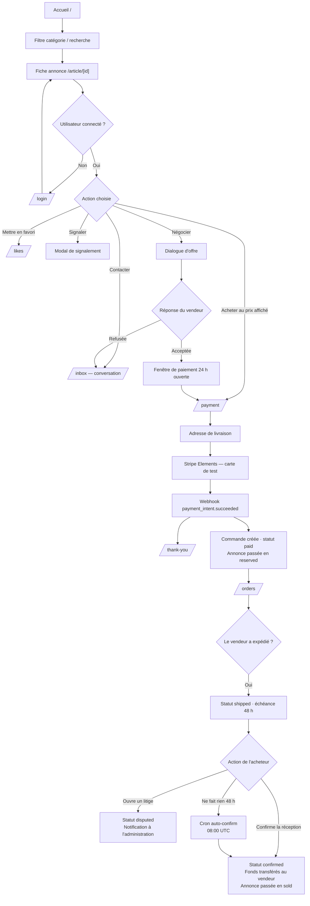
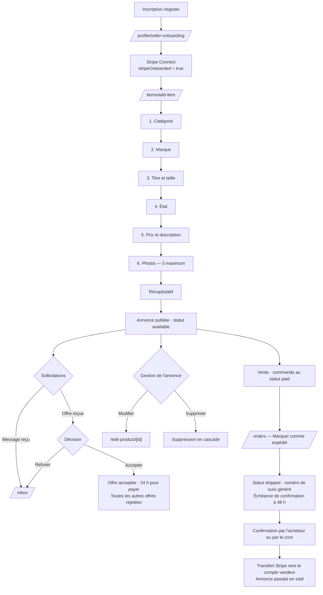
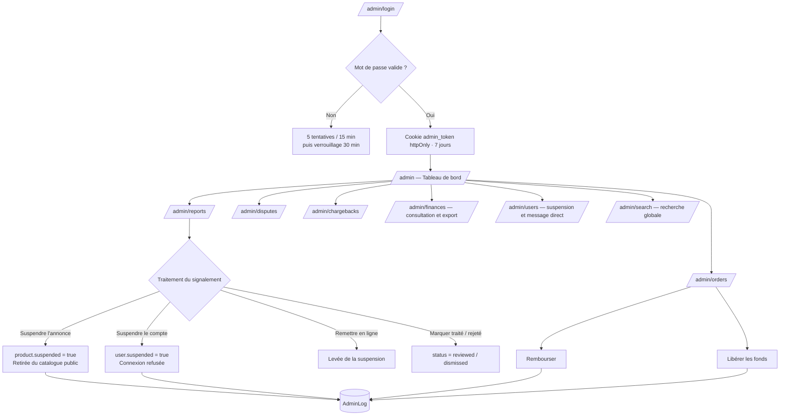

# 07 — Interface, parcours utilisateurs et cas d'utilisation

> Relevé exhaustif des 31 pages de l'application au 28 août 2026.

## 1. Pages publiques et authentifiées

| Route | Fichier | Description | Accès |
|---|---|---|---|
| `/` | `app/page.tsx` | Page d'accueil : bannière d'accroche, statistiques, grille d'annonces filtrable par catégorie, bandeau défilant | Public |
| `/article/[id]` | `app/article/[id]/page.tsx` | Fiche détaillée d'une annonce : carrousel d'images, prix, état, taille, marque, encart vendeur, boutons Acheter / Message / Faire une offre, bouton de signalement | Public |
| `/profile/[id]` | `app/profile/[id]/page.tsx` | Profil public d'un vendeur : avatar, bio, statistiques, ses annonces, bouton de contact, bouton de signalement | Public |
| `/login` | `app/login/page.tsx` | Connexion par e-mail/mot de passe ou Google, bascule de visibilité du mot de passe | Public |
| `/register` | `app/register/page.tsx` | Inscription avec règles de validation, inscription Google | Public |
| `/about` | `app/about/page.tsx` | Présentation du projet — section « Pourquoi FlipIt ? » | Public |
| `/contact` | `app/contact/page.tsx` | Formulaire / informations de contact | Public |
| `/privacy` | `app/privacy/page.tsx` | Politique de confidentialité, en sections | Public |
| `/likes` | `app/likes/page.tsx` | Annonces mises en favori par l'utilisateur | Authentifié |
| `/inbox` | `app/inbox/page.tsx` | Messagerie : liste des conversations à gauche, fil de discussion temps réel à droite, dialogue d'offre | Authentifié |
| `/orders` | `app/orders/page.tsx` | Suivi des commandes en tant qu'acheteur et vendeur : expédier, confirmer, ouvrir un litige | Authentifié |
| `/payment` | `app/payment/page.tsx` | Tunnel de paiement : formulaire de livraison puis Stripe Elements. La modal d'avertissement portfolio y est forcée | Authentifié |
| `/thank-you` | `app/thank-you/page.tsx` | Confirmation d'achat — « Merci pour votre achat ! » | Authentifié |
| `/items/add-item` | `app/items/add-item/page.tsx` | Création d'annonce : formulaire en 6 étapes (catégorie → marque → titre/taille → état → prix/description → photos → récapitulatif) | Authentifié |
| `/edit-product/[id]` | `app/edit-product/[id]/page.tsx` | Modification d'une annonce existante | Propriétaire |
| `/settings` | `app/settings/page.tsx` | Paramètres du compte : photo, bio, informations personnelles, suppression du compte | Authentifié |
| `/profile/seller-onboarding` | `app/profile/seller-onboarding/page.tsx` | Parcours d'activation du compte vendeur Stripe Connect (253 lignes) | Authentifié |

### Pages présentes mais non fonctionnelles

| Route | Problème constaté |
|---|---|
| `/items` | `app/items/page.tsx` retourne littéralement `
page
` — **page fantôme** issue d'un échafaudage jamais complété |
| `/Item_summary/[id]` | `app/Item_summary/[id]/page.tsx` appelle `fetch('http://localhost:3000/api/items/…')` — **URL en dur** : la page ne peut pas fonctionner en production. Le nom du dossier est en outre incohérent avec la convention kebab-case du reste du projet |
| `/landing-page` | Page d'accueil alternative de 488 lignes (« Pourquoi choisir FlipIt ? », « Popular Products », témoignages), non reliée à la navigation — vestige de la phase 2024 |

## 2. Pages d'administration

Accès conditionné au cookie `admin_token` ; `middleware.ts` redirige vers `/admin/login`
toute page `/admin/*` sans cookie valide.

| Route | Description |
|---|---|
| `/admin/login` | Saisie du mot de passe administrateur (limité à 5 tentatives / 15 min par IP) |
| `/admin` | Tableau de bord : statistiques globales de la plateforme |
| `/admin/users` | Liste des utilisateurs, suspension / réactivation, envoi d'un message administrateur |
| `/admin/products` | Liste des annonces, suspension, suppression |
| `/admin/reports` | Signalements regroupés par cible, avec actions de modération |
| `/admin/orders` | Suivi de toutes les commandes, remboursement, libération des fonds |
| `/admin/disputes` | Litiges ouverts par les acheteurs |
| `/admin/chargebacks` | Impayés et contestations remontés par Stripe |
| `/admin/finances` | Vue financière et export |
| `/admin/logs` | Journal des actions d'administration (table `AdminLog`) |
| `/admin/search` | Recherche globale (utilisateurs, annonces, commandes) |

## 3. Parcours acheteur

## 4. Parcours vendeur

## 5. Parcours administrateur

## 6. Cas d'utilisation dérivés des routes

Matière pour le diagramme de cas d'utilisation UML. Trois acteurs, plus un acteur système.

### Acteur : Visiteur (non authentifié)

| Cas d'utilisation | Route / API |
|---|---|
| Consulter le catalogue d'annonces | `/` → `GET /api/products` |
| Filtrer par catégorie et rechercher | `GET /api/products?cat=&q=` |
| Consulter le détail d'une annonce | `/article/[id]` → `GET /api/article/[id]` |
| Consulter un profil vendeur | `/profile/[id]` → `GET /api/user/[id]` |
| Consulter les statistiques publiques | `GET /api/stats` |
| Créer un compte | `/register` |
| Se connecter par identifiants ou Google | `/login` → NextAuth |

### Acteur : Membre (authentifié) — hérite du Visiteur

| Cas d'utilisation | Route / API |
|---|---|
| Mettre une annonce en favori | `POST /api/likes` |
| Consulter ses favoris | `/likes` → `GET /api/likes` |
| Contacter un vendeur | `POST /api/conversations` |
| Échanger des messages en temps réel | `POST /api/conversations/[id]/messages` + Pusher |
| Marquer une conversation comme lue | `POST /api/conversations/[id]/read` |
| Consulter ses messages non lus | `GET /api/messages/unread` |
| Proposer un prix | `POST /api/offer` |
| Accepter ou refuser une offre reçue | `POST /api/offer/status` |
| Acheter une annonce | `POST /api/stripe/payment-intent` |
| Suivre ses commandes | `/orders` → `GET /api/orders` |
| Confirmer la réception d'une commande | `POST /api/orders/[id]/confirm` |
| Ouvrir un litige | `POST /api/orders/[id]/dispute` |
| Signaler une annonce ou un utilisateur | `POST /api/reports` |
| Consulter les messages de l'administration | `GET /api/user/messages` |
| Modifier son profil | `PUT /api/user` |
| Supprimer son compte | `DELETE /api/user` |

### Acteur : Vendeur (membre ayant activé Stripe Connect) — hérite du Membre

| Cas d'utilisation | Route / API |
|---|---|
| Activer son compte de paiement | `/profile/seller-onboarding` → `POST /api/stripe/onboarding` |
| Accéder à son tableau de bord Stripe | `GET /api/stripe/dashboard` |
| Publier une annonce | `POST /api/items` |
| Consulter ses annonces | `GET /api/products/user` |
| Modifier une annonce | `PUT /api/items/[id]` |
| Supprimer une annonce | `DELETE /api/items/[id]` |
| Marquer une commande comme expédiée | `POST /api/orders/[id]/ship` |

### Acteur : Administrateur (session séparée)

| Cas d'utilisation | Route / API |
|---|---|
| Se connecter à l'espace d'administration | `POST /api/admin/auth` |
| Consulter les statistiques de la plateforme | `GET /api/admin/stats` |
| Lister et rechercher utilisateurs, annonces, commandes | `GET /api/admin/users`, `/products`, `/orders`, `/search` |
| Suspendre ou réactiver un compte | `POST /api/admin/users/[id]/suspend` |
| Envoyer un message à un utilisateur | `POST /api/admin/users/[id]/message` |
| Suspendre ou supprimer une annonce | `PATCH` / `DELETE /api/admin/products` |
| Traiter un signalement | `PATCH /api/admin/reports` |
| Rembourser une commande | `POST /api/admin/orders/[id]/refund` |
| Libérer les fonds d'une commande | `POST /api/admin/orders/[id]/release` |
| Consulter litiges et impayés | `GET /api/admin/disputes`, `/chargebacks` |
| Consulter et exporter les données financières | `GET /api/admin/finances`, `/finances/export` |
| Consulter le journal des actions | `GET /api/admin/logs` |

### Acteur système : Services externes

| Cas d'utilisation | Route |
|---|---|
| Stripe notifie un paiement réussi | `POST /api/stripe/webhook` — `payment_intent.succeeded` |
| Stripe notifie une contestation | `POST /api/stripe/webhook` — `charge.dispute.created` / `updated` / `closed` |
| Le planificateur Vercel confirme les commandes échues | `POST /api/cron/auto-confirm` (quotidien, 08:00 UTC) |
| Pusher autorise l'abonnement à un canal privé | `POST /api/pusher/auth` |

## 7. Captures d'écran à réaliser manuellement

Liste des captures à prendre pour les annexes du dossier. Le tableau précise la page **et
l'état** à montrer, afin que chaque capture illustre une compétence identifiable.

### Parcours utilisateur

| # | Page | État à montrer | Illustre |
|---|---|---|---|
| 1 | `/` | Vue large, bannière + grille d'annonces | Conception de l'interface, maquettage |
| 2 | `/` | Grille filtrée sur une catégorie, avec le compteur de résultats | Filtrage côté client, composant `ArticleGrid` |
| 3 | `/` | Rendu en largeur mobile (~375 px) | Adaptation responsive |
| 4 | `/article/[id]` | Annonce avec plusieurs photos et l'encart vendeur | Page de détail, carrousel |
| 5 | `/register` | Formulaire avec une erreur de validation affichée | Validation côté client |
| 6 | `/login` | Formulaire avec le bouton Google visible | Authentification multi-provider |
| 7 | `/items/add-item` | Étape 1 (choix de la catégorie) | Formulaire multi-étapes |
| 8 | `/items/add-item` | Étape 6 (récapitulatif avant publication) | Parcours de création complet |
| 9 | `/items/add-item` | Message d'erreur sur un champ invalide | Validation des entrées |
| 10 | `/inbox` | Conversation ouverte avec plusieurs messages | Messagerie temps réel |
| 11 | `/inbox` | Dialogue « Faire une offre » ouvert | Négociation de prix |
| 12 | `/inbox` | Offre acceptée, avec le compte à rebours de 24 h | Fenêtre de paiement |
| 13 | `/payment` | Formulaire d'adresse de livraison | Tunnel de commande |
| 14 | `/payment` | Stripe Elements avec la modal portfolio affichée | Intégration de paiement + avertissement démo |
| 15 | `/thank-you` | Confirmation après paiement | Fin du tunnel |
| 16 | `/orders` | Commande au statut `paid`, côté vendeur, bouton « Expédier » | Cycle de vie de la commande |
| 17 | `/orders` | Commande au statut `shipped`, côté acheteur, échéance affichée | Délai de confirmation de 48 h |
| 18 | `/orders` | Formulaire d'ouverture de litige | Gestion des litiges |
| 19 | `/profile/[id]` | Profil vendeur avec ses annonces | Page de profil |
| 20 | `/profile/seller-onboarding` | Étape d'activation Stripe Connect | Intégration Stripe Connect |
| 21 | `/settings` | Paramètres du compte | Gestion du compte, RGPD |
| 22 | `/likes` | Liste de favoris | Fonctionnalité de favoris |
| 23 | Modal de signalement | Ouverte, motif sélectionné | Modération |
| 24 | `/` | Thème sombre activé | Gestion du thème |

### Espace d'administration

| # | Page | État à montrer | Illustre |
|---|---|---|---|
| 25 | `/admin/login` | Écran de connexion | Authentification séparée |
| 26 | `/admin/login` | Message de blocage après 5 tentatives | Limitation de débit |
| 27 | `/admin` | Tableau de bord avec statistiques | Vue d'ensemble |
| 28 | `/admin/reports` | Signalements regroupés par cible | Modération |
| 29 | `/admin/users` | Liste avec un compte suspendu | Suspension de compte |
| 30 | `/admin/orders` | Commandes avec actions de remboursement | Gestion financière |
| 31 | `/admin/logs` | Journal des actions | Traçabilité |
| 32 | `/admin` | Barre latérale en version mobile (tiroir ouvert) | Responsive de l'administration |

### Éléments techniques

| # | Objet | État à montrer | Illustre |
|---|---|---|---|
| 33 | Terminal | Sortie complète de `npm test` (141 tests au vert) | Plan de tests exécuté |
| 34 | Terminal | Sortie de `npx tsc --noEmit` sans erreur | Qualité du code |
| 35 | Tableau de bord Stripe (mode test) | Un PaymentIntent et son transfert associé | Intégration de paiement |
| 36 | Console Neon | Les deux points de terminaison (production et développement) | Gestion des environnements |
| 37 | Tableau de bord Vercel | Historique de déploiements et cron configuré | Déploiement |
| 38 | `ERD/diagram.svg` | Diagramme entité-association | Modélisation des données |

> **Rappel avant capture :** masquer toute donnée personnelle réelle et toute valeur
> secrète (clés Stripe, jetons, chaînes de connexion) sur les captures de terminal
> et de tableaux de bord.
